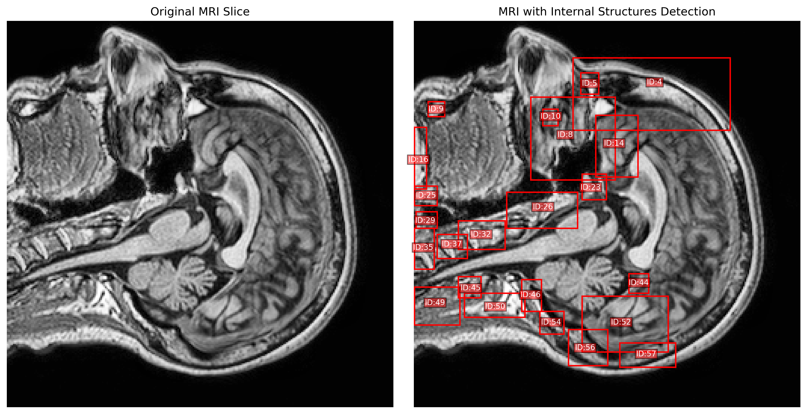
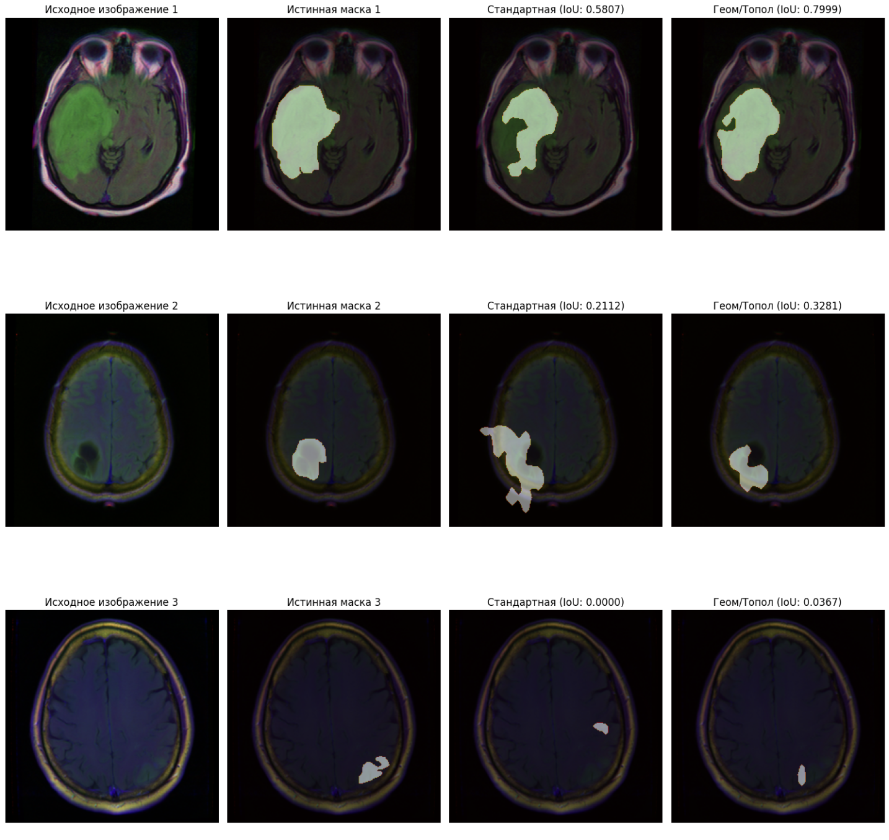
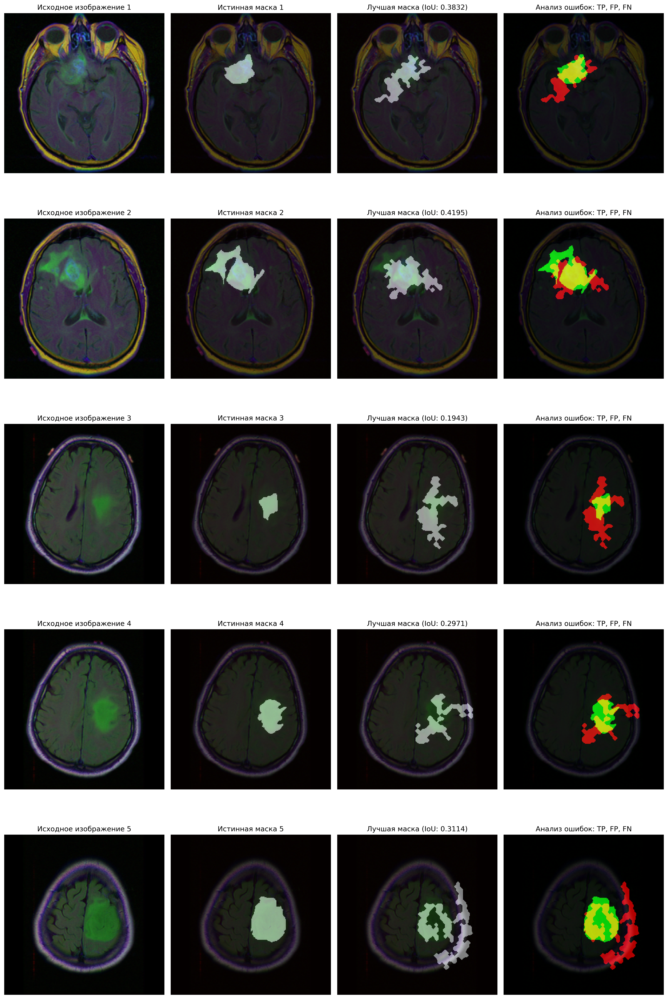

# ВКР на тему "Дифференциально-геометрический подход к анализу данных" ("Differential-Geometric Approach to Data Analysis")

Данный репозиторий представляет реализацию методов дифференциальной геометрии (персистентные диаграммы, графы Риба и дургие) для анализа высокоразмерных данных медицинской визуализации, в частности МРТ снимков. В то время как традиционные методы понижения размерности обеспечивают полезную визуализацию, наш дифференциально-геометрический подход сохраняет критически важные топологические и геометрические свойства многообразия данных, что приводит к более точному обнаружению аномалий и улучшенным результатам классификации.

Вместо обработки МРТ снимков как простых изображений, мы работаем непосредственно с их высокоразмерным представлением, где каждый воксель представляет точку в многомерном пространстве. Наши методы используют инструментарий дифференциальной геометрии для выявления внутренних структур данных, что позволяет более эффективно идентифицировать патологии. 

Мы будем работать с изображеними T1-взвешенной (T1-weighted, T1W) МРТ – тип магнитно-резонансных снимков, в которых контрастность определяется продольной (T1) релаксацией тканей. T1-взвешенная МРТ используется дляоценки анатомии мозга, выявления опухолей, кровоизлияний и атрофии тканей

## Структура репозитория

* IXI-T1
    * Замер ROC-AUC, PR-AUC, сравнение методов понижения размерности. Бинарное определение наличия "особенности" в данных 
    * Топологические методы анализа данных (Персистентные диаграммы, Алгоритм Ripser)
    * Методы дифференциальной геометрии (Анализ кривизны многообразия данных, Метод расслоенных пространств (FiberBundles))
      
* RSNA-ASNR-MICCAI
    *  Замер IoU на датасете Brain Tumor Segmentation (BraTS). Выделение области с "особенностью"
    *  Зависимость качества детекции от типа "особенности"
      
* segmentation_network
    *  Добавление топологических и геометрических признаков в архитектуру U-Net для сегментации опухолей мозга
    *  Сравнение эффективности топологическо-геометрического слоя в различных моделях (U-Net, FCN-ResNet50, DeepLabV3, DualPathTopoNet)

## Преимущества метода

* Сохранение геометрической и топологической информации многообразий данных
* Повышенная чувствительность к малым аномалиям без необходимости увеличения обучающей выборки
* Интерпретируемость результатов с геометрической точки зрения
* Эффективное обнаружение патологий на МРТ снимках

Проект направлен на создание методов, способных лучше идентифицировать аномалии в медицинских изображениях, потенциально улучшая диагностику и анализ МРТ данных в клинической практике.

## Результат

В конечном итоге был создан фреймворк, который работает с многомерным пространством точек в МРТ-скане и возвращает .png снимок с выделенными аномалиями. В качестве итовой модели используется DeepLabV3. В модель был внедрен дополнительный путь обработки топологических признаков, который параллельно основному бэкбону анализирует геометрическую информацию. Данное нововведение позволяет получить качество, которое превосходит результаты оригинальной DeepLabV3.

Пример: 

Датасет IXI-T1 доступен по ссылке: https://brain-development.org/ixi-dataset/, дата обр. 27.01.2025

Датасет Brain Tumor Segmentation (BraTS) доступен по ссылке: http://braintumorsegmentation.org, дата обр. 25.04.2025
