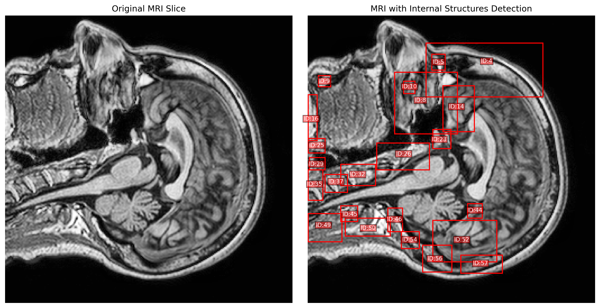

# ВКР на тему "Дифференциально-геометрический подход к анализу данных" ("Differential-Geometric Approach to Data Analysis")

Данный репозиторий представляет реализацию методов дифференциальной геометрии для анализа высокоразмерных данных медицинской визуализации, в частности МРТ снимков. В то время как традиционные методы понижения размерности обеспечивают полезную визуализацию, наш дифференциально-геометрический подход сохраняет критически важные топологические и геометрические свойства многообразия данных, что приводит к более точному обнаружению аномалий и улучшенным результатам классификации.

Вместо обработки МРТ снимков как простых изображений, мы работаем непосредственно с их высокоразмерным представлением, где каждый воксель представляет точку в многомерном пространстве. Наши методы используют инструментарий дифференциальной геометрии для выявления внутренних структур данных, что позволяет более эффективно идентифицировать патологии.

## Преимущества

* Сохранение геометрической и топологической информации многообразий данных
* Повышенная чувствительность к малым аномалиям без необходимости увеличения обучающей выборки
* Интерпретируемость результатов с геометрической точки зрения
* Эффективное обнаружение патологий на МРТ снимках

Проект направлен на создание методов, способных лучше идентифицировать аномалии в медицинских изображениях, потенциально улучшая диагностику и анализ МРТ данных в клинической практике.

Датасет IXI-T1 доступен по ссылке: https://brain-development.org/ixi-dataset/, дата обр. 27.01.2025
